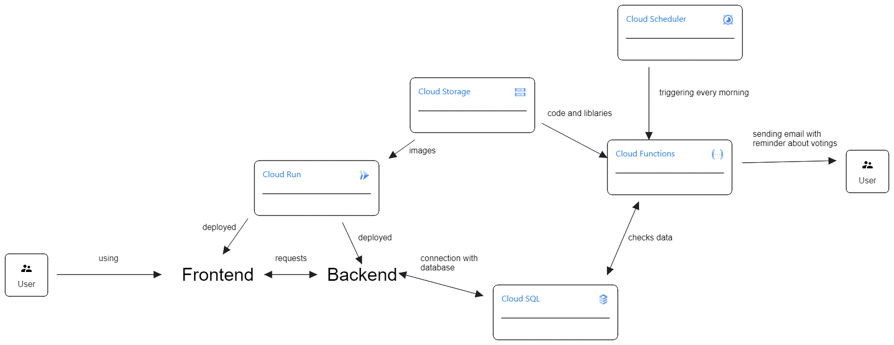

# GCP - Sabre

## Description
Application allows users to create and participate in polls.

- Cloud Storage – storing images
- Cloud Run – to run the backend and frontend in a serverless environment
- Cloud Scheduler – trigger cloud function 
- Cloud Functions – checking data and sending emails
- Cloud SQL - database

## Diagram

