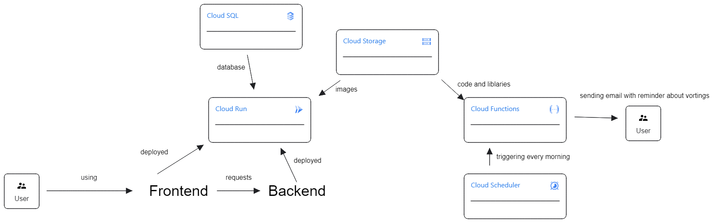

# GCP - Sabre

## Description
Application allows users to create and participate in polls.

- Cloud Storage – store data
- Cloud Run – to run the backend and frontend in a serverless environment
- Cloud Scheduler – to send reminders about the polls
- Cloud Functions – to send a notification

## Diagram
